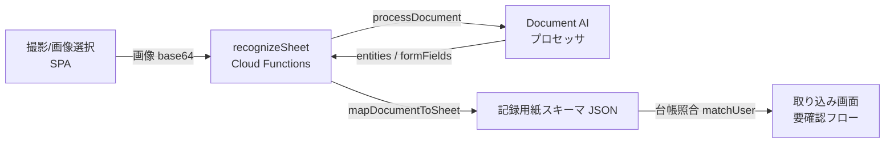

# 記録用紙 OCR バックエンド（Firebase Functions + Google Document AI）

測定会の記録用紙（手書き）を撮影 → Document AI で認識 → 記録用紙スキーマに変換して
「取り込み」画面の要確認フローに流し込むためのバックエンドです。

現状フロントの認識部分はモック（決定論的なダミー）で、業務フロー（キュー → 信頼度フラグ →
修正 → 本登録）は完成済み。このバックエンドは **その「認識」の一手だけ** を実データに差し替えます。

---

## アーキテクチャ（今回のスコープ：OCR のみ）



- **フロント**: `src/lib/ocr.js` … `VITE_OCR_ENDPOINT` があれば実バックエンドを呼ぶ。無ければモック（デモは無変更）
- **バックエンド**: `functions/` … HTTPS 関数 `recognizeSheet`
  - `src/documentai.js` … Document AI 呼び出し（認証は Functions のサービスアカウント＝ADC）
  - `src/mapping.js` … Document AI レスポンス → 記録用紙スキーマ（項目エイリアス照合・数値/全角処理・信頼度%化）※ GCP 非依存で単体テスト可

### フェーズ2：非同期 OCR 取り込みパイプライン（実装済み）

```mermaid
flowchart LR
  A[モバイル撮影] -->|sheets/{batchId}/…| S[Cloud Storage]
  S -->|onObjectFinalized| B[onSheetImageUpload<br/>Cloud Functions]
  B --> C[Document AI]
  B -->|recognition 保存| F[(Firestore<br/>読み取りキュー)]
  F -->|onSnapshot| E[取り込み画面<br/>ライブ取り込み]
  E -->|本登録| M[(Firestore<br/>measurements)]
```

撮影 → Storage 保存 → トリガで自動 OCR → Firestore の読み取りキュー、という非同期構成。
台帳照合・本登録は職員がフロントで行い、本登録時に `measurements` へ永続化する。
**台帳・分析などの表示は現状シード生成のまま**（読み取り側の Firestore 移行は次段）。

- **バックエンド**: `functions/index.js` の `onSheetImageUpload`（Storage トリガ）
  - `src/recognition.js` … パス解析・recognition ドキュメント組み立て（純粋・テスト対象）
- **フロント**: `src/lib/db.js`（`VITE_FIREBASE_CONFIG` があれば有効）
  - `uploadSheetImage` / `watchRecognitions`（onSnapshot 購読）/ `commitRecognition`（measurement 書込＋キュー更新）
  - firebase SDK は動的 import で読み込むため、未設定時はデモのバンドルに含まれない
- **セキュリティルール**: `firestore.rules` / `storage.rules`（認証済み職員のみ・作成はバックエンド）
- **Firestore データモデル**:

  | コレクション | 主なフィールド |
  |---|---|
  | `batches/{batchId}` | `sheetCount` `updatedAt` |
  | `batches/{batchId}/recognitions/{id}` | `no` `status(recognized/committed/error)` `ocrName` `ocrKana` `ocrId` `nameConf` `fields{cid:{value,raw,conf}}` `needsReview` |
  | `measurements/{userId}_{year}` | `userId` `year` `values` `axes` `total` `source:'ocr'` `batchId` |

#### フェーズ2 の追加デプロイ

```bash
# ルールとインデックスを反映(関数は前掲の deploy に含まれる)
firebase deploy --only firestore:rules,firestore:indexes,storage,functions
```

フロントは `VITE_FIREBASE_CONFIG`（Firebase コンソールの Web アプリ構成 JSON を 1 行で）を設定すると、
取り込み画面に「ライブ取り込み（Firestore キュー）」が出現する。職員ログイン（Firebase Auth）は
ルールが `request.auth` を必須にしているため本番前に必ず導入すること。

```
VITE_FIREBASE_CONFIG={"apiKey":"…","authDomain":"…","projectId":"…","storageBucket":"…","appId":"…"}
```

### 職員ログイン（Firebase Auth）

`VITE_FIREBASE_CONFIG` を設定すると、アプリ起動時に**職員ログイン画面**が出る（`src/screens/Login.jsx`）。
未設定の公開デモではログインは一切要求されない（`authEnabled()=false`）。ルールが `request.auth` を
必須にしているため、本番では必ずこの構成で運用する。

1. Firebase コンソール → Authentication → ログイン方法 → **メール/パスワード** を有効化
2. Users → **ユーザーを追加** で職員アカウント（例: テスト用 `test@cruto.jp`）を作成
3. `VITE_FIREBASE_CONFIG` を設定してビルド → ログイン画面から上記アカウントでログイン

**ローカル検証（実プロジェクト不要・Auth エミュレータ）**:

```bash
# エミュレータ起動（別ターミナル）
cd functions && npx firebase emulators:start --only auth --project demo-cruto
# テストアカウントを作成
curl -s -X POST 'http://127.0.0.1:9099/identitytoolkit.googleapis.com/v1/accounts:signUp?key=fake-api-key' \
  -H 'Content-Type: application/json' \
  -d '{"email":"test@cruto.jp","password":"cruto1234","returnSecureToken":true}'
# フロントを Auth エミュレータに向けてビルド/起動
VITE_FIREBASE_CONFIG='{"apiKey":"fake-api-key","authDomain":"demo-cruto.firebaseapp.com","projectId":"demo-cruto","appId":"1:1:web:demo"}' \
VITE_AUTH_EMULATOR_URL='http://127.0.0.1:9099' npm run dev
```

> `VITE_AUTH_EMULATOR_URL` はローカル検証専用。本番/公開デモでは未設定にする（実 Firebase Auth を使う）。

---

## セットアップ手順

前提: GCP プロジェクト（課金有効）、`gcloud` / `firebase-tools`、Node 20。

### 1. API を有効化

```bash
gcloud services enable documentai.googleapis.com cloudfunctions.googleapis.com \
  cloudbuild.googleapis.com run.googleapis.com --project YOUR_PROJECT
```

### 2. Document AI プロセッサを作成

まずは **Form Parser**（汎用フォームパーサ）で開始するのが早い。精度を詰める段階で
**Custom Extractor**（この記録用紙専用に項目を学習）へ移行できる。`mapping.js` は両対応。

- コンソール: Document AI → プロセッサを作成 → Form Parser → リージョン `us`（または `eu`）
- 作成後の **プロセッサ ID** と **ロケーション** を控える

> ヒント: Custom Extractor にする場合、項目（エンティティ）名を `walk5` / `balR` / … の cid か、
> 「握力右」等の日本語ラベルで定義すれば `mapping.js` がそのまま拾います。

### 3. IAM（Functions のサービスアカウントに権限付与）

Cloud Functions 実行 SA（既定 `YOUR_PROJECT@appspot.gserviceaccount.com`）に Document AI 呼び出し権限を付与:

```bash
gcloud projects add-iam-policy-binding YOUR_PROJECT \
  --member "serviceAccount:YOUR_PROJECT@appspot.gserviceaccount.com" \
  --role "roles/documentai.apiUser"
```

### 4. プロジェクトを紐付け・設定

```bash
cp .firebaserc.example .firebaserc      # default に YOUR_PROJECT を記入
cp functions/.env.example functions/.env # DOCAI_* を記入
cd functions && npm install
```

`functions/.env` の主な項目:

| 変数 | 例 | 説明 |
|---|---|---|
| `DOCAI_PROJECT_ID` | `my-proj` | ローカルのみ必要（本番は自動設定） |
| `DOCAI_LOCATION` | `us` | プロセッサのロケーション |
| `DOCAI_PROCESSOR_ID` | `abcdef012345` | 作成したプロセッサ ID |
| `OCR_API_KEY` | （任意） | フロントの `VITE_OCR_API_KEY` と一致させる簡易認証 |
| `OCR_ALLOW_ORIGIN` | `https://konohito.github.io` | CORS 許可オリジン |

### 5. ローカルで確認（エミュレータ）

**GCP 資格情報が無くても**、取り込みパイプライン全体をエミュレータで通しで検証できる。
`FUNCTIONS_EMULATOR=true` かつ `DOCAI_PROCESSOR_ID` 未設定のとき、Document AI の呼び出しは
**モック認識**（`src/mockdoc.js`）に自動で切り替わる（本番では絶対に使われない）。

```bash
cd functions
npm test          # 単体テスト（mapping / recognition / mockdoc）— GCP 不要
npm run test:e2e  # E2E: Storage 保存→トリガ→OCR(モック)→Firestore まで通しで検証（GCP 不要）
```

`npm run test:e2e` は Firestore / Storage / Functions エミュレータを立て、記録用紙画像を
Storage に保存 → `onSheetImageUpload` 発火 → 読み取りキュー（`batches/{id}/recognitions`）に
結果が入るまでを実際に動かして検証する（要 Java。エミュレータ jar は初回のみ自動DL）。

実 Document AI で確認する場合（要 `functions/.env` の `DOCAI_*` と ADC）:

```bash
npm run serve                   # emulators:start（要 ADC: gcloud auth application-default login）
```

別ターミナルから:

```bash
curl -X POST http://localhost:5001/YOUR_PROJECT/asia-northeast1/recognizeSheet \
  -H 'Content-Type: application/json' \
  -d "{\"imageBase64\":\"$(base64 -w0 sample-sheet.jpg)\",\"mimeType\":\"image/jpeg\"}"
```

### 6. デプロイ

手動で 1 回:

```bash
firebase deploy --only functions   # predeploy で npm test が走る
```

出力される関数 URL（例 `https://asia-northeast1-YOUR_PROJECT.cloudfunctions.net/recognizeSheet`）を控える。

以降は下記の GitHub Actions で **main へのマージ＝自動デプロイ** にできる。

#### GitHub Actions によるバックエンド自動デプロイ

フロントの Pages デプロイ（`deploy.yml`）と同様に、バックエンドも `deploy-functions.yml` で
マージ時に自動デプロイされる（`functions/**` やルール変更時のみ発火）。**Secrets/Variables を
設定するまではデプロイ手順をスキップするだけで、ジョブは失敗しない**（安全側）。

1. **デプロイ用サービスアカウントを作成**し、JSON 鍵を発行

   ```bash
   gcloud iam service-accounts create gh-deployer --project YOUR_PROJECT
   # デプロイに必要なロール（最小構成の目安。組織ポリシーに応じて調整）
   for R in roles/cloudfunctions.admin roles/firebasehosting.admin roles/datastore.owner \
            roles/firebaserules.admin roles/iam.serviceAccountUser roles/serviceusage.serviceUsageConsumer; do
     gcloud projects add-iam-policy-binding YOUR_PROJECT \
       --member "serviceAccount:gh-deployer@YOUR_PROJECT.iam.gserviceaccount.com" --role "$R"
   done
   gcloud iam service-accounts keys create key.json \
     --iam-account gh-deployer@YOUR_PROJECT.iam.gserviceaccount.com
   ```

2. **GitHub リポジトリに登録**（Settings → Secrets and variables → Actions）
   - Secrets: `FIREBASE_SERVICE_ACCOUNT` = `key.json` の中身（JSON 全体）
   - Variables: `FIREBASE_PROJECT_ID` = `YOUR_PROJECT`
   - 登録後は `key.json` をローカルから削除する

3. 以降 `functions/**`・`*.rules`・`firestore.indexes.json` を含む変更が main にマージされると
   自動で `firebase deploy --only functions,firestore:rules,firestore:indexes,storage` が走る。
   手動実行は Actions タブの「Deploy OCR backend」→ Run workflow から。

> より安全にするなら、JSON 鍵の代わりに **Workload Identity Federation（OIDC）** で
> `google-github-actions/auth` を鍵レス連携にできる（鍵の保管が不要になる）。

### 7. フロントを接続

ビルド時の環境変数（Vite の `VITE_` プレフィックス）で有効化する。**設定した瞬間に「取り込み」
画面へ「実データで読み取り」パネルが出現**し、写真から本物の認識ができる。

- ローカル: `.env.local` に記載
  ```
  VITE_OCR_ENDPOINT=https://asia-northeast1-YOUR_PROJECT.cloudfunctions.net/recognizeSheet
  VITE_OCR_API_KEY=（OCR_API_KEY を設定した場合）
  ```
- GitHub Pages: リポジトリ Secret に登録し、`.github/workflows/deploy.yml` の build ステップに
  `env:` として渡す（`VITE_OCR_ENDPOINT: ${{ secrets.OCR_ENDPOINT }}`）。未設定ならデモのまま。

---

## セキュリティ（本番前に必須）

- **公開 SPA から呼ぶ点に注意**: エンドポイントもフロントの API キーも利用者に見える。恒久策は
  **職員ログイン（Firebase Auth）＋ App Check** を導入し、関数側でトークン検証すること。`OCR_API_KEY`
  は導入までの簡易的な速度制限に過ぎない
- `OCR_ALLOW_ORIGIN` は本番の SPA URL に限定する（`*` のままにしない）
- `maxInstances`（既定 10）で暴発時のコスト上限を掛けている

## コストの目安

- Document AI: 認識ページ数に対する従量課金（1,000 ページ単位）。測定会の枚数規模なら小さい
- Cloud Functions: 実行時間・回数の従量。待機中はゼロスケールで課金ほぼ 0
- 正確な単価は GCP の最新価格表を参照

## ファイル構成

```
functions/
  index.js                 # HTTPS 関数 recognizeSheet + Storage トリガ onSheetImageUpload
  src/config.js            # 環境変数
  src/documentai.js        # Document AI クライアント（エミュレータ/CI ではモックに自動切替）
  src/mockdoc.js           # 合成 Document AI レスポンス（GCP 不要の検証・デモ用）
  src/mapping.js           # レスポンス → 記録用紙スキーマ（純粋関数・テスト対象）
  src/recognition.js       # Storage パス解析・recognition ドキュメント組み立て
  test/mapping.test.cjs    # 単体テスト（マッピング）
  test/recognition.test.cjs# 単体テスト（recognition 組み立て）
  test/mockdoc.test.cjs    # 単体テスト（モック認識）
  test/e2e-pipeline.cjs    # E2E（エミュレータで Storage→トリガ→OCR→Firestore を通し検証）
  .env.example
firebase.json              # functions のデプロイ設定（predeploy に test）
.firebaserc.example
.github/workflows/
  deploy.yml               # フロント（GitHub Pages）自動デプロイ
  deploy-functions.yml     # バックエンド（Firebase Functions/ルール）自動デプロイ ← 追加
src/lib/ocr.js             # フロントの継ぎ目（モック↔実API 切替＋台帳照合）
src/lib/db.js              # Firestore/Storage の継ぎ目（firebaseApp を Auth と共有）
src/lib/auth.js            # Firebase Auth の継ぎ目（職員ログイン。未設定時は無効）
src/ui/AuthGate.jsx        # 認証ゲート（未設定=素通し / 設定あり=未ログインならログイン画面）
src/screens/Login.jsx      # 職員ログイン画面
```
