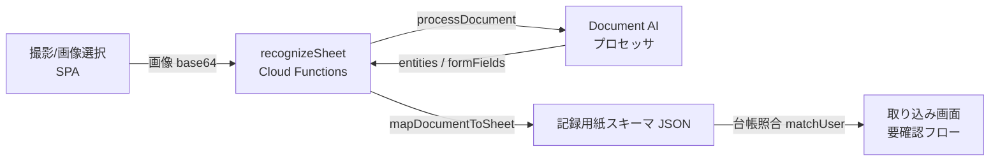
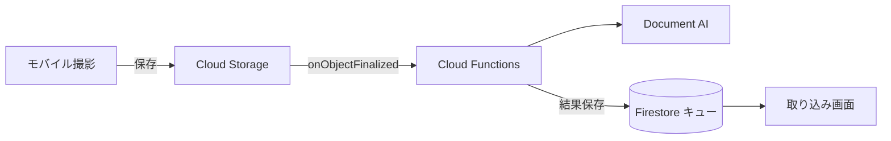

# 記録用紙 OCR バックエンド（Firebase Functions + Google Document AI）

測定会の記録用紙（手書き）を撮影 → Document AI で認識 → 記録用紙スキーマに変換して
「取り込み」画面の要確認フローに流し込むためのバックエンドです。

現状フロントの認識部分はモック（決定論的なダミー）で、業務フロー（キュー → 信頼度フラグ →
修正 → 本登録）は完成済み。このバックエンドは **その「認識」の一手だけ** を実データに差し替えます。

---

## アーキテクチャ（今回のスコープ：OCR のみ）



- **フロント**: `src/lib/ocr.js` … `VITE_OCR_ENDPOINT` があれば実バックエンドを呼ぶ。無ければモック（デモは無変更）
- **バックエンド**: `functions/` … HTTPS 関数 `recognizeSheet`
  - `src/documentai.js` … Document AI 呼び出し（認証は Functions のサービスアカウント＝ADC）
  - `src/mapping.js` … Document AI レスポンス → 記録用紙スキーマ（項目エイリアス照合・数値/全角処理・信頼度%化）※ GCP 非依存で単体テスト可

### 将来（フェーズ2：保存層まで本番化する場合）



撮影 → Storage 保存 → トリガで自動 OCR → Firestore キューへ、という非同期構成。今回は範囲外
（モバイル画面の「Cloud Storage へ送信」という説明はこの構成を想定した文言）。

---

## セットアップ手順

前提: GCP プロジェクト（課金有効）、`gcloud` / `firebase-tools`、Node 20。

### 1. API を有効化

```bash
gcloud services enable documentai.googleapis.com cloudfunctions.googleapis.com \
  cloudbuild.googleapis.com run.googleapis.com --project YOUR_PROJECT
```

### 2. Document AI プロセッサを作成

まずは **Form Parser**（汎用フォームパーサ）で開始するのが早い。精度を詰める段階で
**Custom Extractor**（この記録用紙専用に項目を学習）へ移行できる。`mapping.js` は両対応。

- コンソール: Document AI → プロセッサを作成 → Form Parser → リージョン `us`（または `eu`）
- 作成後の **プロセッサ ID** と **ロケーション** を控える

> ヒント: Custom Extractor にする場合、項目（エンティティ）名を `walk5` / `balR` / … の cid か、
> 「握力右」等の日本語ラベルで定義すれば `mapping.js` がそのまま拾います。

### 3. IAM（Functions のサービスアカウントに権限付与）

Cloud Functions 実行 SA（既定 `YOUR_PROJECT@appspot.gserviceaccount.com`）に Document AI 呼び出し権限を付与:

```bash
gcloud projects add-iam-policy-binding YOUR_PROJECT \
  --member "serviceAccount:YOUR_PROJECT@appspot.gserviceaccount.com" \
  --role "roles/documentai.apiUser"
```

### 4. プロジェクトを紐付け・設定

```bash
cp .firebaserc.example .firebaserc      # default に YOUR_PROJECT を記入
cp functions/.env.example functions/.env # DOCAI_* を記入
cd functions && npm install
```

`functions/.env` の主な項目:

| 変数 | 例 | 説明 |
|---|---|---|
| `DOCAI_PROJECT_ID` | `my-proj` | ローカルのみ必要（本番は自動設定） |
| `DOCAI_LOCATION` | `us` | プロセッサのロケーション |
| `DOCAI_PROCESSOR_ID` | `abcdef012345` | 作成したプロセッサ ID |
| `OCR_API_KEY` | （任意） | フロントの `VITE_OCR_API_KEY` と一致させる簡易認証 |
| `OCR_ALLOW_ORIGIN` | `https://konohito.github.io` | CORS 許可オリジン |

### 5. ローカルで確認（エミュレータ）

```bash
cd functions
npm test                        # mapping.js の単体テスト（GCP 不要）
npm run serve                   # emulators:start（要 ADC: gcloud auth application-default login）
```

別ターミナルから:

```bash
curl -X POST http://localhost:5001/YOUR_PROJECT/asia-northeast1/recognizeSheet \
  -H 'Content-Type: application/json' \
  -d "{\"imageBase64\":\"$(base64 -w0 sample-sheet.jpg)\",\"mimeType\":\"image/jpeg\"}"
```

### 6. デプロイ

```bash
firebase deploy --only functions   # predeploy で npm test が走る
```

出力される関数 URL（例 `https://asia-northeast1-YOUR_PROJECT.cloudfunctions.net/recognizeSheet`）を控える。

### 7. フロントを接続

ビルド時の環境変数（Vite の `VITE_` プレフィックス）で有効化する。**設定した瞬間に「取り込み」
画面へ「実データで読み取り」パネルが出現**し、写真から本物の認識ができる。

- ローカル: `.env.local` に記載
  ```
  VITE_OCR_ENDPOINT=https://asia-northeast1-YOUR_PROJECT.cloudfunctions.net/recognizeSheet
  VITE_OCR_API_KEY=（OCR_API_KEY を設定した場合）
  ```
- GitHub Pages: リポジトリ Secret に登録し、`.github/workflows/deploy.yml` の build ステップに
  `env:` として渡す（`VITE_OCR_ENDPOINT: ${{ secrets.OCR_ENDPOINT }}`）。未設定ならデモのまま。

---

## セキュリティ（本番前に必須）

- **公開 SPA から呼ぶ点に注意**: エンドポイントもフロントの API キーも利用者に見える。恒久策は
  **職員ログイン（Firebase Auth）＋ App Check** を導入し、関数側でトークン検証すること。`OCR_API_KEY`
  は導入までの簡易的な速度制限に過ぎない
- `OCR_ALLOW_ORIGIN` は本番の SPA URL に限定する（`*` のままにしない）
- `maxInstances`（既定 10）で暴発時のコスト上限を掛けている

## コストの目安

- Document AI: 認識ページ数に対する従量課金（1,000 ページ単位）。測定会の枚数規模なら小さい
- Cloud Functions: 実行時間・回数の従量。待機中はゼロスケールで課金ほぼ 0
- 正確な単価は GCP の最新価格表を参照

## ファイル構成

```
functions/
  index.js              # HTTPS 関数 recognizeSheet（CORS・APIキー・エラー処理）
  src/config.js         # 環境変数
  src/documentai.js     # Document AI クライアント
  src/mapping.js        # レスポンス → 記録用紙スキーマ（純粋関数・テスト対象）
  test/mapping.test.cjs # 単体テスト（npm不要で実行可）
  .env.example
firebase.json           # functions のデプロイ設定（predeploy に test）
.firebaserc.example
src/lib/ocr.js          # フロントの継ぎ目（モック↔実API 切替＋台帳照合）
```
